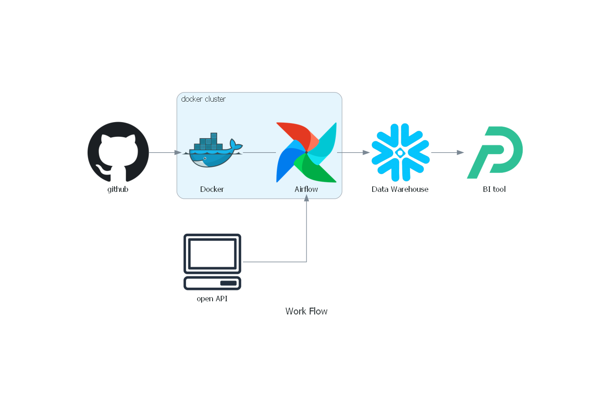

# 개요

## 프로젝트 주제

**인천 출발 항공편 데이터를 활용한 세계 날씨, 환율 비교**

항공편, 세계 날씨, 환율 데이터를 수집하여 인천 출발 항공편 정보와 도착 도시의 날씨 및 환율 정보를 대시보드에 시각화 하는 프로젝트입니다.
## 활용 데이터

|데이터|URL|
|---|---|
|항공 API|https://aviationstack.com/documentation|
|항공편 가격 API|https://developers.amadeus.com/self-service/category/flights/api-doc/flight-offers-search/api-reference|
|환율 API|https://www.koreaexim.go.kr/ir/HPHKIR020M01?apino=2&viewtype=C&searchselect=&searchword=#none|
|날씨 API|https://openweathermap.org/api/one-call-3|

## 프로젝트 보고서

https://fossil-chinchilla-b56.notion.site/25357d06882346598b9dd54504a508fc

# 사용 기술

|항목|기술명|
|---|---|
|데이터 수집|Open API|
|데이터 웨어하우스|Snowflake|
|데이터 파이프라인|Airflow|
|대시보드|Preset.io|
|환경 세팅 및 관리|Docker|
|협업 도구|Slack, Github|

# 대시보드

- 필터 선택 전

- 필터 선택 후

# 참여자 정보 및 각 역할
|이름|담당 업무|
|---|---|
|박단이|데이터 웨어하우스 세팅, 대시보드 세팅, ERD 설계, 세계 환율 데이터 EDA·ETL·ELT, 세계지도·환율 차트 생성|
|박진영|Airflow 세팅, 나라/도시 데이터 정리, 세계 날씨 데이터 EDA·ETL·ELT, 날씨 차트 생성|
|이보경|Github 세팅, 항공편·항공편 가격 데이터 EDA·ETL·ELT, 항공편 차트 생성|

# 어려웠던 점 및 해결 방안
1. 데이터들 연동의 어려움
    
    각각의 데이터 소스(항공편, 환율, 날씨)에서의 나라 및 도시 표기 방식이 달라서 대시보드에 제공할 나라와 도시의 범위를 정하고 해당 도시들 간의 표기 방식을 통합하는 테이블(country_city_code)을 만들어서 활용했습니다.
    
2. Snowflake의 동작 방식에 의한 어려움
    
    DAG를 실행했을 때 error가 많이 발생한 이유 중 하나가 Snowflake의 특징 때문이었습니다. 하나는 Snowflake가 다중 질의를 실행시켰을 때 error를 발생시킨다는 것이었고, 또 하나는 CATS를 사용할 때 default까지 계승되지 않는다는 것이었습니다. 
    
    따라서 하나의 질의를 각각 실행시키고, default를 활용해야 하는 경우는 CREATE TABLE한 후 INSERT INTO를 하는 식으로 코드를 변경해서 작성했습니다.
